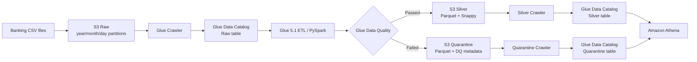

# AWS Data Lake — S3, Glue & Athena

An end-to-end AWS data engineering project that builds a small banking data lake with **Amazon S3**, **AWS Glue**, **Glue Data Quality**, and **Amazon Athena**.

The project demonstrates a production-oriented flow from raw CSV ingestion to cataloged, typed Parquet data, with data quality checks, quarantine handling, IAM least privilege, partitioning, and SQL analytics.

## Architecture



## What this project demonstrates

- S3 object storage, prefixes and Hive-style partitioning
- Versioning, lifecycle configuration and storage classes
- IAM roles, trust policies and least-privilege access
- AWS Glue Crawlers and Glue Data Catalog
- Glue 5.1 PySpark ETL jobs
- CSV → typed Parquet transformation
- Deduplication and schema normalization
- Glue Data Quality with row-level outcomes
- Quarantine pattern for rejected records
- Athena queries over S3 using Glue metadata
- Partition pruning and columnar analytics

## Data flow

The sample dataset is partitioned by ingestion date:

```text
raw/transactions/
└── year=2026/
    └── month=09/
        ├── day=10/transactions.csv
        ├── day=11/transactions.csv
        └── day=12/transactions.csv
```

Raw data intentionally includes quality issues:

- duplicate `transaction_id`
- missing `amount`
- negative `amount`

The Glue job performs:

1. Read from the Glue Data Catalog.
2. Deduplicate on `transaction_id`.
3. Cast `amount` from `double` to `decimal(18,2)`.
4. Cast `timestamp` from `string` to `timestamp`.
5. Evaluate data quality rules.
6. Write valid records to `silver/transactions/`.
7. Write failed records with DQ metadata to `quarantine/transactions/`.

### Expected pipeline result

| Stage | Row count |
|---|---:|
| Raw | 11 |
| After deduplication | 10 |
| Silver / valid | 8 |
| Quarantine / invalid | 2 |

The 2 rejected records generate 3 rule violations because one record fails more than one rule.

## Data quality rules

```text
IsComplete "transaction_id"
IsComplete "customer_id"
IsComplete "account_id"
IsComplete "amount"
ColumnValues "amount" > 0
IsComplete "currency"
IsComplete "timestamp"
```

Example failures:

```text
TX005 → amount = -20.00 → ColumnValues "amount" > 0
TX006 → amount = NULL   → IsComplete "amount"
                         → ColumnValues "amount" > 0
```

## Repository structure

```text
.
├── data/                         # Sample raw input
├── docs/                         # Architecture, IAM and DQ notes
├── infra/
│   ├── iam/                      # IAM policy templates
│   └── lifecycle.json            # S3 lifecycle example
├── scripts/                      # AWS CLI deployment / execution helpers
├── sql/                          # Athena queries
├── src/
│   └── glue/
│       └── raw_to_silver.py      # Main Glue ETL + DQ job
├── .env.example
├── .gitignore
├── Makefile
└── README.md
```

## Prerequisites

- AWS account
- AWS CLI v2
- An authenticated AWS CLI profile
- Permissions to create/manage:
  - S3
  - IAM roles/policies
  - Glue Data Catalog / Crawlers / Jobs
  - CloudWatch Logs
  - Athena

> **Cost note:** Glue jobs and crawlers can incur charges. Keep crawlers on-demand and stop after the lab. Athena is billed based on scanned data. Use a budget alert in learning accounts.

## Quick start

### 1. Configure the project

```bash
cp .env.example .env
```

Edit `.env`:

```bash
AWS_REGION=eu-west-3
BUCKET_NAME=de-banking-lake-<unique>
AWS_PROFILE=default
```

Load it:

```bash
set -a
source .env
set +a
```

### 2. Bootstrap S3 and upload sample data

```bash
bash scripts/bootstrap_s3.sh
```

### 3. Deploy Glue resources

```bash
bash scripts/deploy_glue.sh
```

### 4. Run the raw crawler

```bash
aws glue start-crawler \
  --name banking-raw-transactions-crawler \
  --region "$AWS_REGION" \
  --profile "$AWS_PROFILE"
```

Wait until the crawler state returns to `READY`.

### 5. Run the ETL job

```bash
bash scripts/run_pipeline.sh
```

### 6. Query with Athena

Use the SQL files under [`sql/`](sql/).

Example:

```sql
SELECT COUNT(*) AS total_rows
FROM transactions;
```

Run it against the `banking_silver_db` database.

## Security model

The architecture intentionally separates responsibilities:

```text
Crawler role
├── List/Get raw
├── List/Get silver
└── List/Get quarantine

ETL role
├── Get raw
├── Get Glue script
├── Put/Delete silver
└── Put/Delete quarantine
```

The Glue service assumes the roles through:

```text
Principal: glue.amazonaws.com
Action: sts:AssumeRole
```

No AWS account IDs, access keys, secret keys or session tokens belong in this repository.

See [`docs/iam-security.md`](docs/iam-security.md).

## Silver schema

```text
transaction_id STRING
customer_id    STRING
account_id     STRING
amount         DECIMAL(18,2)
currency       STRING
country        STRING
timestamp      TIMESTAMP
year           STRING  (partition)
month          STRING  (partition)
day            STRING  (partition)
```

## Quarantine schema

The quarantine dataset preserves the original business columns plus row-level DQ metadata:

```text
dataqualityrulespass
dataqualityrulesfail
dataqualityrulesskip
dataqualityevaluationresult
```

This makes rejected records explainable and queryable instead of silently dropping them.

## Useful Athena queries

### One row per DQ violation

```sql
SELECT
    transaction_id,
    amount,
    failed_rule
FROM transactions
CROSS JOIN UNNEST(dataqualityrulesfail) AS t(failed_rule)
ORDER BY transaction_id, failed_rule;
```

### Quality failure counts

```sql
SELECT
    failed_rule,
    COUNT(*) AS failure_count
FROM transactions
CROSS JOIN UNNEST(dataqualityrulesfail) AS t(failed_rule)
GROUP BY failed_rule
ORDER BY failure_count DESC;
```

## Key engineering decisions

**Why Parquet in Silver?**  
Columnar storage, compression, typed schema and reduced scan volume for analytical workloads.

**Why `DECIMAL(18,2)` for money?**  
It avoids binary floating-point behavior associated with `double`.

**Why keep a quarantine layer?**  
Bad records remain traceable and diagnosable instead of being silently discarded.

**Why partition by `year/month/day`?**  
Glue and Athena can use partition pruning to avoid unnecessary scans.

**Why separate crawler and ETL IAM roles?**  
Least privilege and clearer separation of responsibilities.

## Next improvements

- Infrastructure as Code with Terraform
- Event-driven ingestion
- Glue job bookmarks
- CI/CD for Glue scripts and policies
- CloudWatch alarms and operational dashboards
- Automated tests for transformations and DQ rules
- Lake Formation governance
- Databricks / Delta Lake implementation of the same banking pipeline

## Project status

This repository formalizes a completed hands-on learning project. The pipeline has been exercised end-to-end with:

- S3 partitioned raw data
- Glue Crawler schema inference
- Glue Data Catalog partitions
- Glue 5.1 ETL
- Parquet Silver layer
- Data Quality + quarantine
- Athena analytics

See [`docs/project-results.md`](docs/project-results.md) for the observed results.
