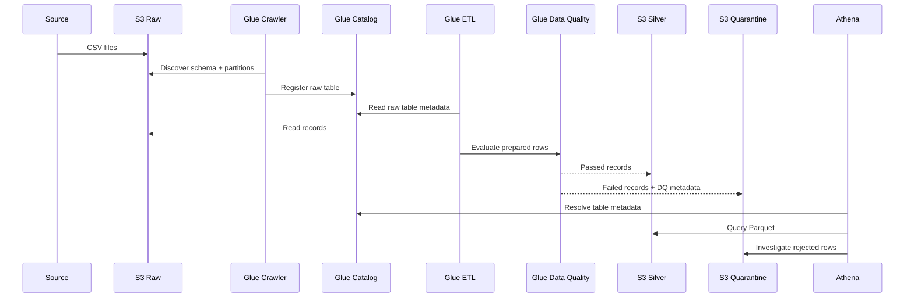

# Architecture

## Logical zones

```text
S3
├── raw/
│   └── transactions/year=YYYY/month=MM/day=DD/
├── silver/
│   └── transactions/year=YYYY/month=MM/day=DD/
├── quarantine/
│   └── transactions/year=YYYY/month=MM/day=DD/
├── scripts/
│   └── glue/
└── athena-results/
```

## Components

### Amazon S3

S3 is the persistence layer. The project uses Hive-style partition paths (`year=.../month=.../day=...`) so Glue and Athena can expose these values as partition keys.

### Glue Crawler

The raw crawler discovers the CSV schema and partitions, then creates/updates a metadata table in `banking_raw_db`.

After the ETL job completes, separate crawlers catalog the Silver and Quarantine Parquet datasets.

### Glue Data Catalog

The Catalog stores metadata, not the transaction rows themselves. It records schema, physical S3 location, format, and partitions.

### Glue ETL Job

The Glue 5.1 job uses PySpark to:

- deduplicate `transaction_id`
- cast `amount` to `decimal(18,2)`
- parse `timestamp`
- run row-level DQ checks
- route valid rows to Silver
- route invalid rows to Quarantine

### Amazon Athena

Athena queries the S3 data directly using Glue metadata. Partition filters reduce the amount of data that needs to be scanned.

## End-to-end flow


